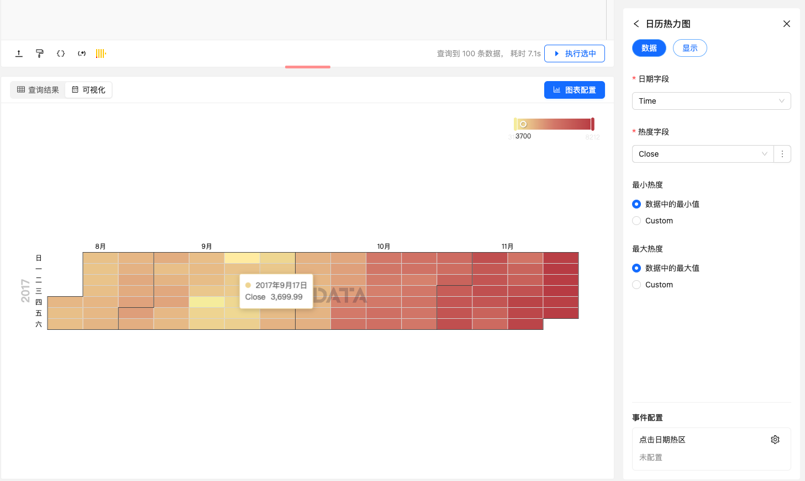

日历图（Calendar Chart）是一种数据可视化图表类型，用于展示时间序列数据在日历形式上的分布情况。
通常情况下，日历图以月份为单位，将每个日期作为一个方格，并根据数据的不同特征对方格进行着色或填充，以反映该日期的数据特征或指标。

日历图通常包含以下要素：

- 日期方格（Date Square）：日历图中的每个方格代表一个日期，通常按照月份排列。方格的大小通常是固定的，以确保整个日历图的整洁和可读性。
- 颜色填充（Color Fill）：根据数据特征或指标，日历图会对每个日期的方格进行着色或填充，以反映该日期的数据情况。通常采用不同的颜色或渐变来表示不同的数据范围或分类。
- 数据标签（Data Label）：有时，日历图会在方格内或相邻位置显示具体的数据数值或指标，以便观察者能够更清晰地了解每个日期的数据情况。

日历图适用于展示时间序列数据在不同日期上的分布情况，特别适用于呈现周期性或季节性变化、特定日期的事件或活动等。
它能够直观地显示数据的时间模式，并帮助观察者发现数据的潜在规律或趋势。

## 使用方式


1. **日期字段**：用于表示日历热力图中时间字段。
2. **热度字段**：表示不同日期需求属性数值大小。 


### 数据示例

```py
select toDateTime(Time/1000) as Time, * from klines.spot_1d where Symbol = 'btc_usdt' and Exchange = 'Binance' order by Time limit 100
```


## 日历热度图设置

### 显示设置

1. **最小/最大热度**：设置最小/最大颜色等级。
2. **颜色**：进行图像热力等级颜色设置。  


### 图例


