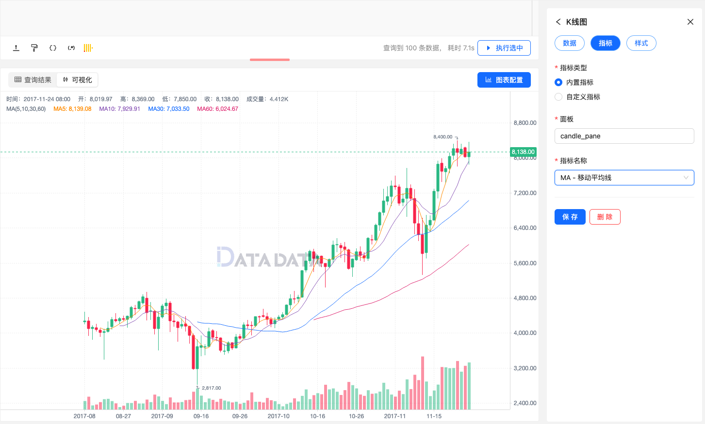

K 线图（K-Line Chart）是一种用于展示金融市场交易数据的图表类型，常用于展示股票、期货、外汇等金融资产的价格变动情况。
K 线图由一系列竖直线段组成，每个线段代表一个时间周期（例如一天、一周或一个小时），并通过线段的长度和位置来反映价格的开盘价、收盘价、最高价和最低价。

K 线图通常包含以下要素：

- 蜡烛线（Candlestick）：K 线图的主要组成部分，由一系列竖直线段和矩形组成。每个蜡烛线表示一个时间周期内的价格变动情况，矩形部分表示开盘价和收盘价之间的价格区间，而竖直线段表示最高价和最低价之间的价格波动范围。
- 时间轴（Time Axis）：横轴通常表示时间，每个蜡烛线代表一个时间周期，例如一天、一周或一个小时。
- 价格轴（Price Axis）：纵轴表示价格，根据交易市场的不同，价格轴可以显示股票、期货或外汇等金融资产的价格。
- 标签（Labels）：K 线图通常附带标签，用于标识价格、时间或其他重要信息，以帮助观察者理解图表中的内容。

K 线图适用于展示金融市场的价格变动情况，特别适用于分析股票、期货或外汇等金融资产的价格走势和趋势。
它能够直观地展示价格的波动情况，帮助交易者进行技术分析和决策。

## 使用方式


1. **K线属性字段**：选择K线开盘价，收盘价，最低价，最高价，成交量和成交额属性字段。


### 数据示例

```py
data = query("select * from derive.f_daily_quotes WHERE product_name = '螺纹钢' and contract = 'RB2501' ")

return data.sort_values('day')
```


## K线图设置

### 显示设置

1. **精度设置**：您可以根据需求对价格和交易量的显示精度进行设置，以确保数据的准确性和一致性。
2. **指标设置**：平台支持添加多种内置指标（如主流均线、RSI、Bollinger Bands等），以及通过自定义K线数据计算的外部指标。您可以选择将这些指标显示在主面板（K线图中）或新面板（K线图下方），方便进行多维度分析。
3. **样式设置**：您可以自定义图表的样式和颜色方案，包括选择合适的风格，并调整涨跌的颜色设置，帮助您更直观地捕捉市场变化。

### 图例


