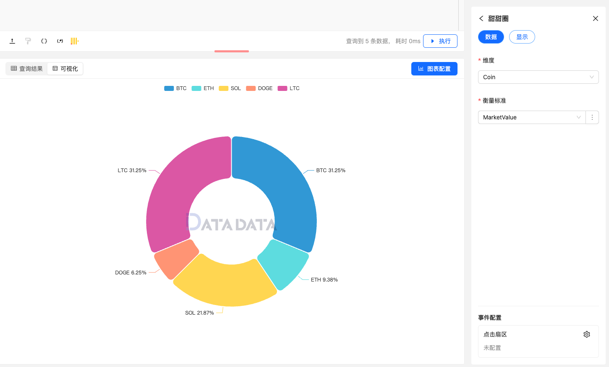

甜甜圈图（Donut Chart）是一种类似于扇形图的可视化图表，但它在中心位置留下了空白，呈现出一个“甜甜圈”的形状。它用于展示分类数据的比例，能够直观地表示各个分类的占比情况。

甜甜圈图的结构与扇形图相似，但空心中心使得它更加美观且适合显示多个层次的信息，常用于展示组成部分的占比。


## 使用方式


1. **维度字段**：用于表示甜甜圈中各个分类字段。
2. **衡量标准字段**：表示甜甜圈中各个维度的数值大小。 


### 数据示例

```py
# 创建 DataFrame
data = {
    "Coin": ["BTC", "ETH", "SOL", "DOGE", "LTC"],
    "MarketValue": [100, 30, 70, 20, 100]
}

return data
```


## 甜甜圈设置

### 显示设置

1. **标签**：设置标签位置。
1. **扇形**：设置扇形水平和垂直位置角度。  
2. **图例**：设置图例各个属性设置。


### 图例


