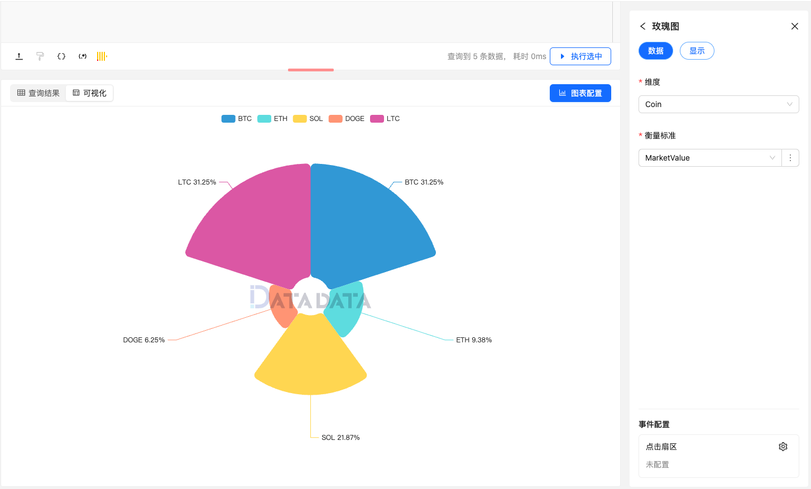

玫瑰图（也叫极坐标条形图或极坐标图）是一种常用于显示分布和比较数据的可视化图表。它的形式类似于扇形图，用于展示不同类别的数值大小和分布情况。玫瑰图通过扇形的角度和长度直观地展示数据的相对比例和趋势，尤其适合展示周期性数据或与角度相关的数据。

**主要特点：**
每个扇形区域代表一个分类，区域的角度表示该分类的数量或比例。
扇形的长度表示该类别在总数据中的占比，类似于柱状图的“高度”。


## 使用方式


1. **维度字段**：用于表示玫瑰圈中各个分类字段。
2. **衡量标准字段**：表示玫瑰圈中各个维度的数值大小。 


### 数据示例

```py
# 创建 DataFrame
data = {
    "Coin": ["BTC", "ETH", "SOL", "DOGE", "LTC"],
    "MarketValue": [100, 90, 70, 20, 40]
}

return data
```


## 玫瑰图设置

### 显示设置

1. **标签**：设置标签位置。
1. **扇形**：设置扇形位置和玫瑰类型。  
2. **图例**：设置图例各个属性。


### 图例


