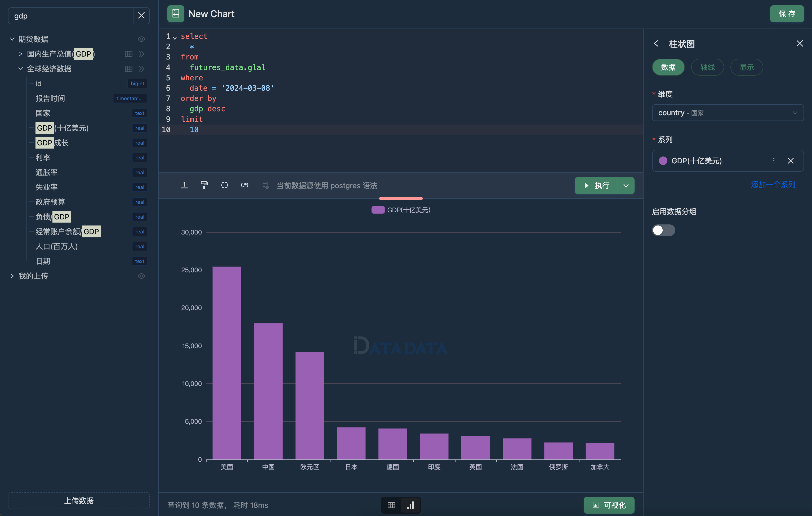
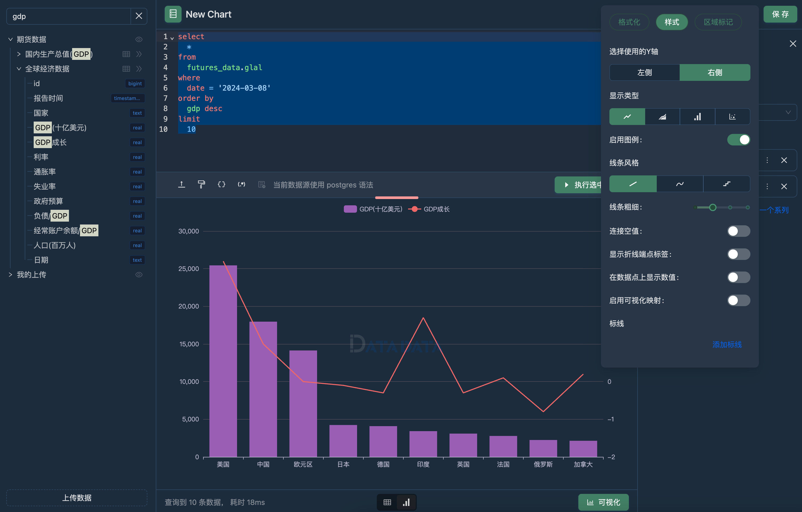
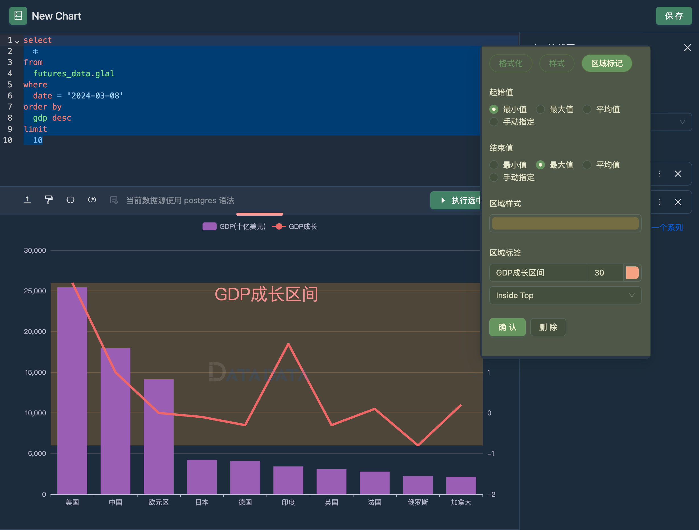

柱状图（也称为条形图）是一种常见的数据可视化图表类型，通常用于展示数据的分布、比较不同类别之间的数量或频率，并突出显示各类别之间的差异。
柱状图通常由一系列垂直排列的矩形（柱子）组成，每个矩形的高度代表数据的数值大小。
在水平方向上，也可以使用条形图，其中矩形的宽度代表数据的大小。

柱状图通常包含以下要素：

- 横轴（X 轴）：横轴表示不同的类别或者变量。例如，如果柱状图用于展示销售数据，则横轴可以表示不同的产品或时间段。
- 纵轴（Y 轴）：纵轴表示数据的数值大小。根据数据的具体情况，纵轴可以表示数量、频率、百分比等。
- 柱子：柱子是柱状图的主要组成部分，用于表示每个类别或变量的数据量或者数值大小。柱子的高度或宽度与对应数据的大小成正比。
- 数据标签：通常在每个柱子的顶部显示具体的数值，以便观察者更清晰地理解数据。

柱状图的优点包括易于理解、直观、清晰明了，适用于展示不同类别之间的数量关系或趋势。
它可以帮助观察者快速比较各个类别之间的数据差异，以及识别出现有的模式或异常。

## 使用方式

首先，编写合适的 SQL 查询出数据，数据要求有：

1. X 轴数据不能重复
2. 系列字段需要为数值类型

例如下面的 SQL 查询出某个日期的全球 GDP 排名数据：

```sql
select * from futures_data.glal where date = '2024-03-08' order by gdp desc limit 10
```



## 多个系列

您可以添加多个系列，并设置每个系列的展示方式。



## 区域标记

使用区域标记功能，可以高亮数值轴上的一段区域。


