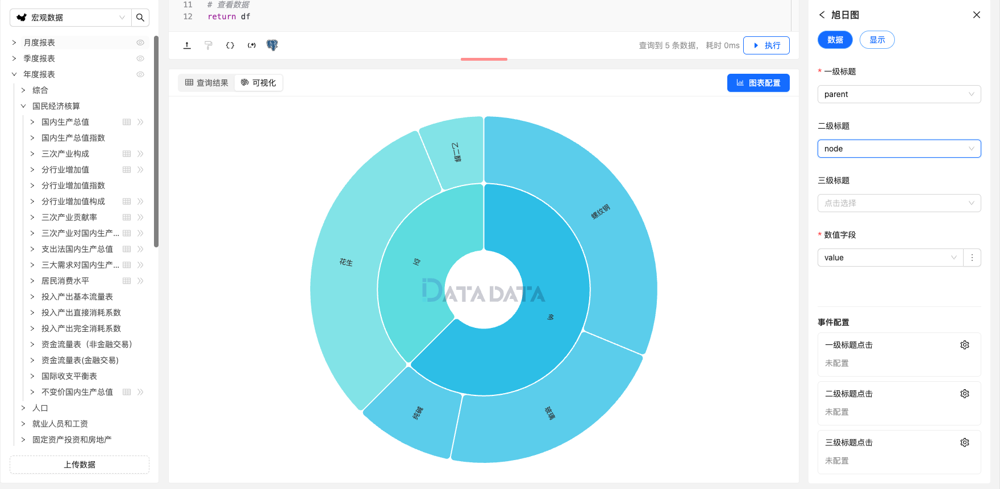

旭日图（Sunburst Chart）是一种用于展示层次数据结构的环形图表类型。
旭日图通常由多个环形组成，每个环形代表数据的一个层级，最外层的圆环表示最高层级，而内部的圆环表示逐级深入的层级。
旭日图的扇区大小不仅表示其在整体数据中的比例或权重，还表示子层级的相对大小。

旭日图通常包含以下要素：

- 圆环（Ring）：旭日图由多个环形组成，每个环形代表数据的一个层级，最外层的圆环表示最高层级，而内部的圆环表示逐级深入的层级。
- 扇区（Sector）：每个圆环被分成多个扇区，每个扇区代表数据中的一个部分或子类别。扇区的大小通常表示其在整体数据中的比例或权重，以及子层级的相对大小。
- 标签（Label）：旭日图的每个扇区通常附带标签，用于标识其名称或含义，以帮助观察者理解图表中的内容。

旭日图适用于展示具有多级层次结构的数据，特别适用于呈现树状结构、组织结构或分类数据。
它能够直观地展示数据的层次结构和组织关系，帮助观察者理解数据的分布和组织情况。


## 使用方式


1. **层级字段**：至少包含一级和二级字段，用于展示数据的层级结构（如分类与子分类）。  
2. **数值字段**：需为数值类型，表示每个节点的大小或权重。  


### 数据示例


```py
# 创建 DataFrame
data = {
    "Parent": ["多", "多", "多", "空", "空"],
    "Node": ["螺纹钢", "纯碱", "玻璃", "乙二醇", "花生"],
    "Value": [100, 30, 70, 20, 100]
}

return data
```


## 旭日图设置

### 数据要求

1. **层级字段**：表示数据的分层关系，例如 `Parent` 和 `Node` 列。  
2. **数值字段**：表示每个节点的权重，例如 `Value` 列。  


### 显示设置

1. **标签最小可见度**：为小权重节点设置标签显示的阈值，优化可视化效果。  


### 图例




