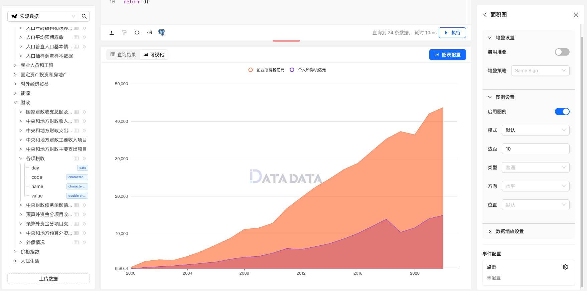

面积图是一种数据可视化图表类型，类似于折线图，但在折线下方填充了颜色，形成了一个封闭的区域，用于强调数据的累积或总量，并展示数据的变化趋势。
面积图常用于展示时间序列数据，以及比较不同类别之间的累积数量或占比情况。

面积图通常包含以下要素：

- 横轴（X 轴）：横轴表示时间、类别或其他连续型变量，用于标识数据点的位置。
- 纵轴（Y 轴）：纵轴表示数据的数值大小，用于标识数据点在纵向上的位置。
- 面积：面积图在折线下方填充了颜色，形成了一个封闭的区域，用于强调数据的累积或总量。面积的大小直观地反映了数据的累积情况。
- 折线：与折线图类似，面积图也包含连接各个数据点的折线，用于显示数据的变化趋势。
- 数据点：在折线上标记的数据点表示具体的数据数值，以便观察者能够准确地了解每个时间点或类别的数据情况。

面积图的优点包括清晰地显示数据的累积情况、突出趋势以及对比不同类别之间的差异。
它可以帮助观察者更直观地理解数据的总体变化趋势和累积效应。

## 使用方式


1. **维度字段**：用于表示折线图的 X 轴，通常为时间、日期或分类字段。
2. **系列字段**：表示各个面积图对应的类别。 


### 数据示例

```py
# 创建 DataFrame
data = query('select * from yearly.a0806')

# 转换为 DataFrame
df = DataFrame(data)

df = df.pivot(index="day", columns="name", values="value")
```


## 折线图设置

### 显示设置

1. **数据**：设置数据各类显示效果。
1. **轴线**：设置轴线各个属性显示效果。  
2. **显示**：进行堆叠，图例和数据缩放各个属性设置。


### 图例


