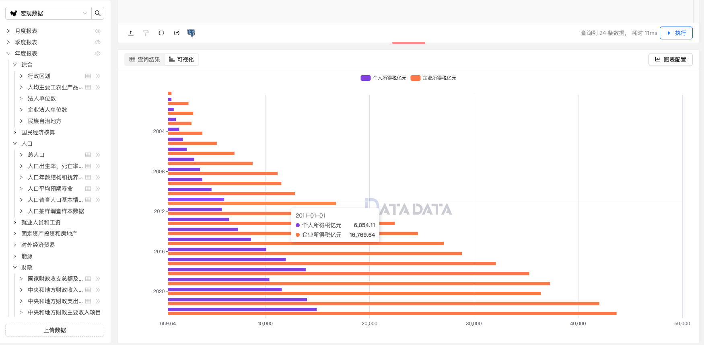

横向柱状图是柱状图的一种变体，其中柱子的方向是水平的而不是垂直的。
它通常用于比较不同类别之间的数量或大小，特别适用于类别名称较长或需要显示大量数据时，以确保标签的清晰可读性。

横向柱状图的优点包括易于比较不同类别之间的数量或大小，尤其适用于类别名称较长或需要显示大量数据时。
它可以帮助观察者快速识别数据的差异，以及发现潜在的模式或异常情况。

## 使用方式


1. **维度字段**：用于表示折线图的 X 轴，通常为时间、日期或分类字段。
2. **系列字段**：表示各个柱状图对应的类别。 


### 数据示例

```py
# 创建 DataFrame
data = query('select * from yearly.a0806')

# 转换为 DataFrame
df = DataFrame(data)

df = df.pivot(index="day", columns="name", values="value")

# 查看数据
return df.sort_values('day') 
```


## 横向柱状图设置

### 显示设置

1. **数据**：设置数据各类显示效果。
1. **轴线**：设置轴线各个属性显示效果。  
2. **显示**：进行堆叠，图例和数据缩放各个属性设置。


### 图例


