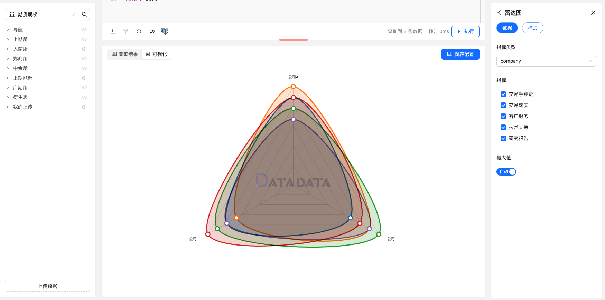

雷达图（Radar Chart），又称为蜘蛛网图或极坐标图，是一种用于展示多维数据的可视化图表。它通过在一个以中心为起点的多条轴上绘制数据点，将多个变量以放射状的方式展示，从而显示数据的相对关系。

雷达图通常具有以下特点：

- **多个轴线**（Axes）：每个轴线代表一个数据维度，轴线的数量对应于数据维度的数量。
- **数据点**（Data Points）：每个数据点在相应的轴线上根据其数值的位置来确定，多个数据点通过线连接形成闭环。
- **数据连线**（Data Line）：连接各个数据点的线条，帮助更清晰地比较不同维度的数据变化。
- **填充颜色**（Color Fill）：部分雷达图会在数据点之间填充颜色，以突出显示数据的相对强度或差异。

雷达图非常适用于展示不同项目或对象在多个维度上的综合表现，尤其适合展示多维度的对比分析。

## 使用方式

1. **指标类型字段**：选择雷达图中的指标类型字段，用于指定比较的不同指标。
2. **指标字段**：选择用于区分不同指标类型的字段，通常用于比较不同的指标类别。

### 数据示例

```py
data = {
    "公司": ["公司A", "公司B", "公司C"],
    "交易手续费": [8, 6, 7],          # 交易手续费
    "交易速度": [9, 8, 6],        # 交易速度
    "客户服务": [7, 9, 8],      # 客户服务
    "技术支持": [8, 7, 9], # 技术支持
    "研究报告": [6, 8, 7]      # 研究报告
}

return data
```

## 雷达图设置

### 显示设置

1. **雷达图样式**：设置雷达图的具体显示属性，可制定不同雷达图样式。


### 图例


